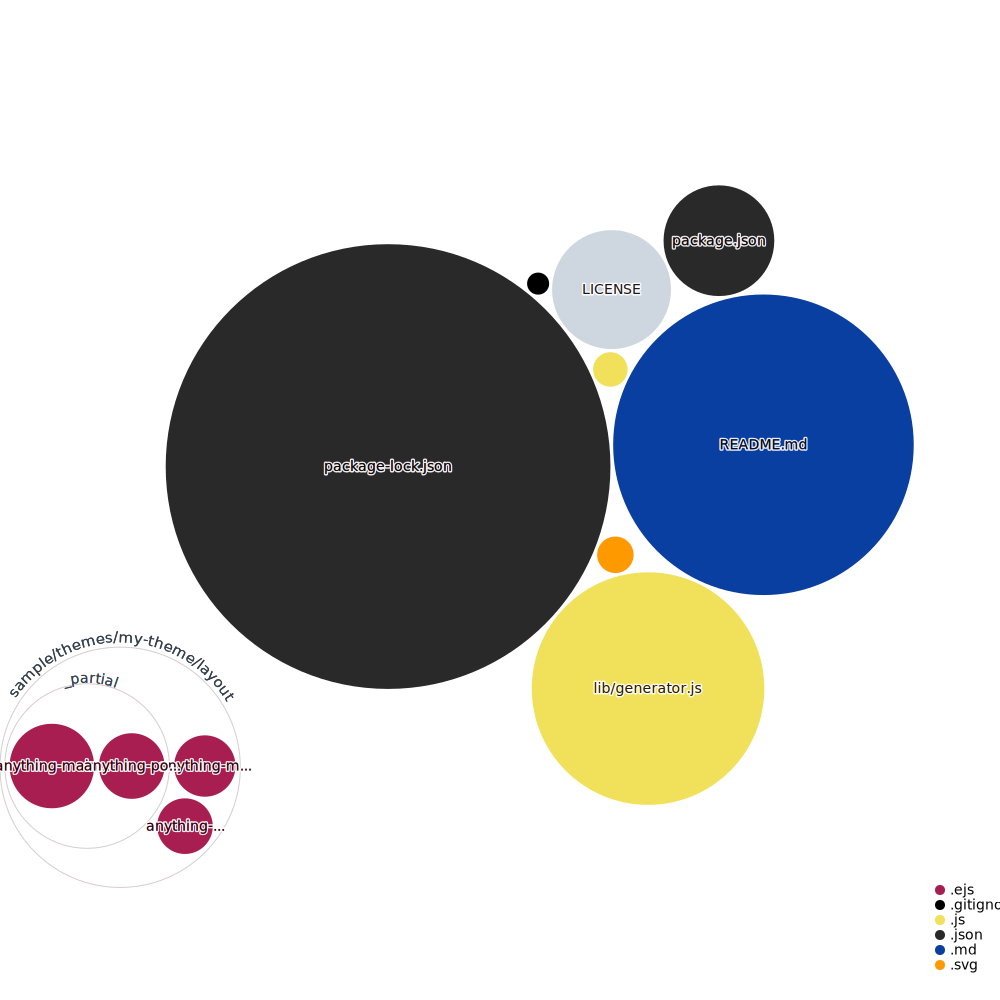

[](https://github.com/kristofzerbe/hexo-generator-anything/blob/main/package.json)
[](https://github.com/kristofzerbe/hexo-generator-anything/issues)
[](https://www.npmjs.com/package/hexo-generator-anything)

# hexo-generator-anything

**Hexo plugin to generate index pages from custom front matter variables.**

> :information_source: This project is a fork from [hexo-index-anything](https://github.com/leviwheatcroft/hexo-index-anything) by Levi Wheatcroft, who is no longer maintaining the project. I have refactored the code and introduced some new features ... see below.

## Introduction

Suppose you have an **author** variable in your front matter, this plugin will generate an **overview page** of all authors (called MAIN INDEX) and for each author, a listing page with all posts by that author (POSTS INDEX).

You can define multiple indexes to be created, by configuring several ``index_mappings`` out of your Frontmatter variables (see Configuration).

### Example

The Frontmatter data of the following two posts...

**../source/_posts/post-1.md**

``` md
---
title: First Post
author: Maria
---
```

**../source/_posts/post-2.md**

``` md
---
title: Second Post
author: Jonas
---
```

**../source/_posts/post-3.md**

``` md
---
title: Third Post
author: Jonas
---
```

... will lead to:
- ``../output/author/index.html``  
MAIN INDEX file with a link list of all authors

- ``../output/author/maria.html``  
POSTS INDEX file with list of all posts from Maria, here 'First Post' only

- ``../output/author/jonas.html``  
POSTS INDEX file with list of all posts from Jonas, here 'Second Post' and 'Third Post'

If you have activated the Hexo configuration attribute [``post_asset_folder``](https://hexo.io/docs/asset-folders.html), then the output will be:

- ``../output/author/index.html``
- ``../output/author/maria/index.html``
- ``../output/author/jonas/index.html``

## Installation

You'll find the package at [npm/hexo-generator-anything](https://www.npmjs.com/package/hexo-generator-anything). For installation just tun following command in your console:

``npm install hexo-generator-anything --save``

## Configuration

### _config.yml

To configure the plugin, add following section to your Hexo's root ``_config.yml``:

```yml
anything:
  defaults:
    layout:
      main: anything-main
      posts: anything-posts
  index_mappings:
    - variable: author
      path: author
    - variable: example
      path: example
      layout:
        posts: anything-posts-example
    - variable: another-variable
      path: others
      skip_main: true

```

The settings in depth:

| Settings | Description |
|---------|------------|
| layout.main | EJS template for processing MAIN INDEX file<br>(if not set, Hexo's default ``index.ejs`` will be used) |
| layout.posts | EJS template for processing POSTS INDEX file<br>(if not set, Hexo's default ``index.ejs`` will be used) |
| index_mappings | List of Anything mappings |
| ... variable | Frontmatter variable in your posts to generate an index of |
| ... path | Part of the path of the output files, which represents the index |
| ... layout.[main\|posts] | Override default layout EJS template for this mapping |
| ... skip_main | Skip rendering of MAIN INDEX, including the folder |

You can find examples for ``layout_main.ejs`` and ``layout_posts.ejs`` (and their partials) in the package ``samples`` folder under ``/node_modules/hexo-generator-anything/`` after installation. Place the files in your Hexo's layout folder.

### Skipping the MAIN INDEX

By using ``skip_main = true`` on a mapping you can suppress the generation of the MAIN INDEX and the main folder itself. The output will be:

- ``../output/maria/index.html``
- ``../output/jonas/index.html``

### Additional Markdown Files

For generating the POSTS INDEX page, you can enrich the information about each author (variable value = key), by providing a Markdown file in in your sources folder: ``../source/_anything/{index}/{key}``.

To stay with the example above, we have in index called ``authors`` and two keys: ``maria`` and ``jonas``:

``` txt
|- source
|  |- _anything
|  |  |- authors
|  |  |  |-> maria.md
|  |  |  |-> jonas.md 
```

Each of these files has to have at least one Frontmatter variable called ``title``, where you can overwrite the default key string (value of the index variable in the posts). You can extend the Frontmatter with as many variables as you want and use it in your POSTS INDEX EJS template.

The content of the MD file will also be available in the data for generating the POSTS INDEX page.

Example:

```md
---
title: Marias Posts
avatar: ./photos/maria.jpg
email: maria@my-domain.com
---

Maria is writer of the month. Don't miss her tweets on [https://twitter.com/maria](https://twitter.com/maria)
```

The MAIN INDEX page, may have a linked Markdown file too, to provide content or additional data:

```txt
|- source
|  |- _anything
|  |  |- authors
|  |  |  |-> index.md
|  |  |  |-> ...
```

## Usage

Install, configure, then run `hexo generate` as usual.

## Contributing

Yes, please ... fork the project, make your changes and submit pull requests against the main branch.

## Demo

I have created this project for my blog and I use it to group some posts into series. You can see the result at: [**https://kiko.io/series**](https://kiko.io/series)

## More Information

I have a section for this project on my blog with posts regarding this project (automatically generated by this plugin ;) at [**http://kiko.io/projects/hexo-generator-anything**](http://kiko.io/projects/hexo-generator-anything)

## History

**2.0.0**

- New configuration structure (Breaking Change)
- New configuration feature '{mapping}.layout.[main|posts]' to override the default template for a particular mapping
- New configuration feature '{mapping}.skip_main' to suppress generation of MAIN INDEX
- Code refactoring to make it more understandable

**1.0.5**

- Path fix (Lowercase)

**1.0.4**

- Replaced vulnerable string.js library

**1.0.3**

- Refactorings
- Introducing Markdown file for INDEX page
- ``titleSeparator`` setting removed
- Updated samples

**1.0.1/2**

- Markdown data fix

**1.0.0**

- Initial version

## License

**MIT** : http://opensource.org/licenses/MIT

## Codebase Vizualization
For an inactive diagram, please visit [Repo Visualization App](https://octo-repo-visualization.vercel.app/?repo=kristofzerbe%2Fhexo-generator-anything)...

